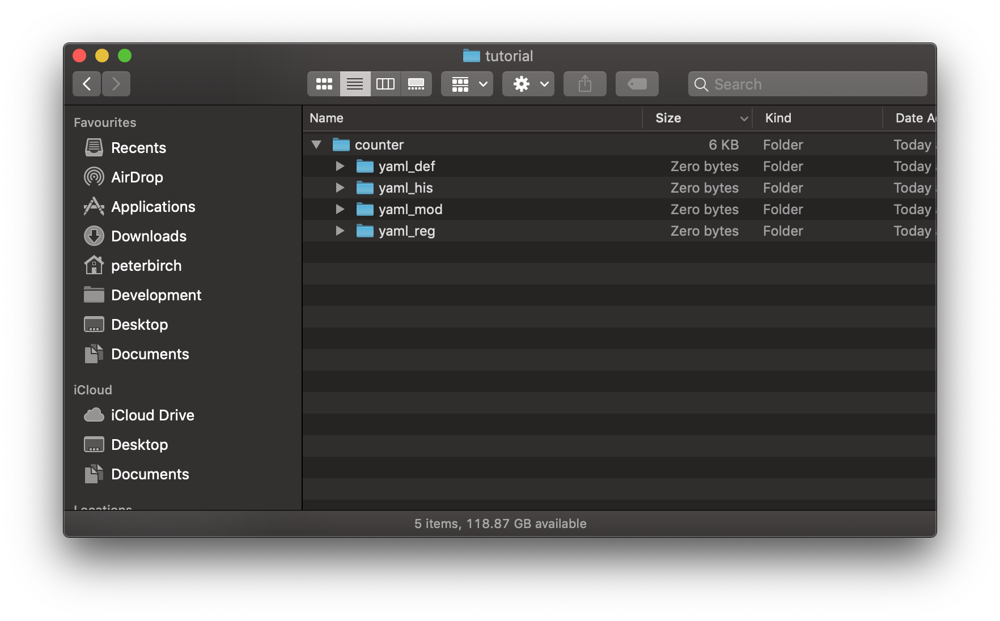
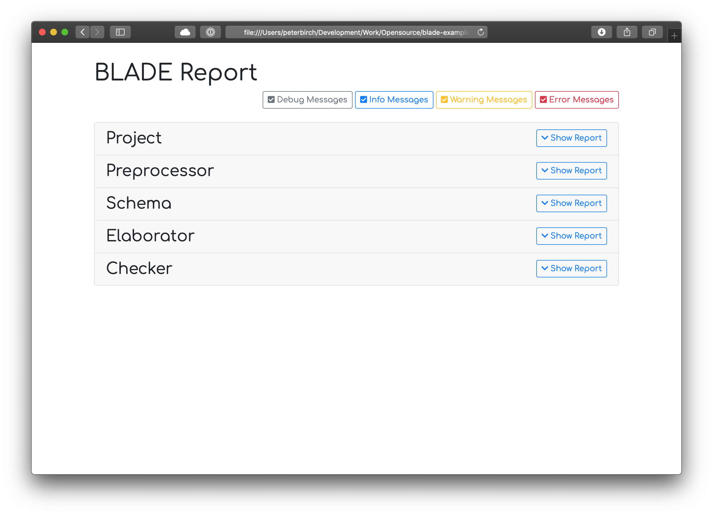
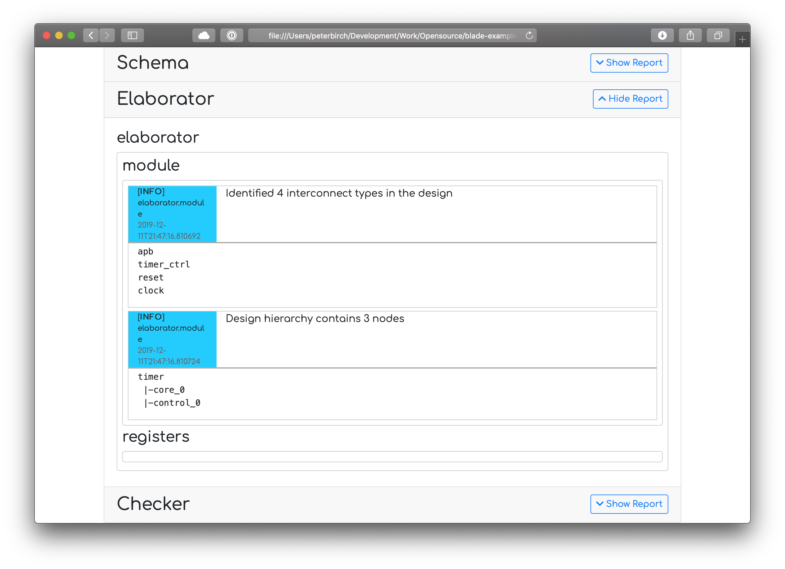
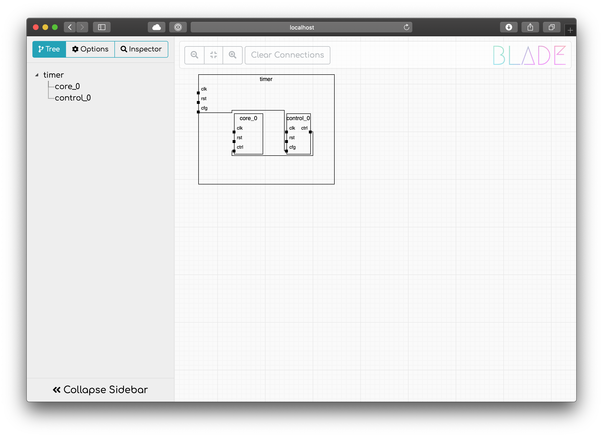
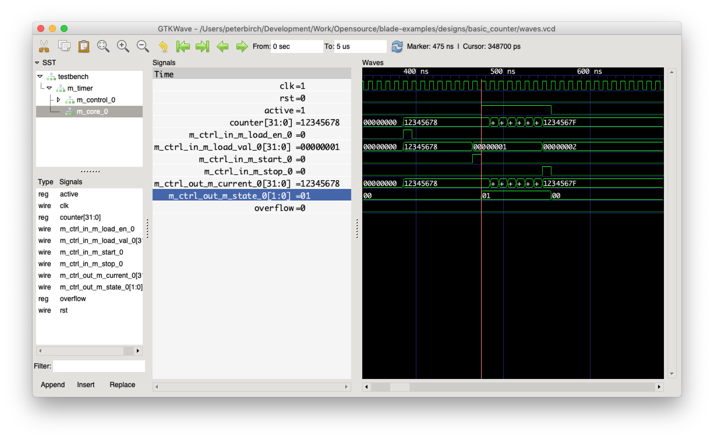

# Counter Design Tutorial

This tutorial will take you through the steps of creating a basic design using BLADE - by the end of it you will have built a timer controlled by a register bank.

## Getting Started

Before we begin, you will need to have BLADE setup in your environment. If you're doing this for the first time, we recommend using a [virtual environment](https://docs.python.org/3/tutorial/venv.html) so that you can get the package dependencies right before installing permanently them to your system path.

```bash
$> virtualenv venv
$> source venv/bin/activate
$> pip install blu-blade blu-blade-templating
```

*Note: You will need to install Python 3.6 or newer to use BLADE - one option for this is [pyenv](https://github.com/pyenv/pyenv) which allows you to install any version of Python without upsetting your system's base install.*

## Setting up Your Workspace

For this project we're going to need to create a bunch of definitions for BLADE to work with. It will help if we can group them together in a sensible manner - we suggest the following folder structure, although you can alter as you wish:



 * `yaml_def` - contains defined constants, useful for keeping consistency across a growing design.
 * `yaml_his` - contains `!His` interconnect definitions, used to construct ports and connections.
 * `yaml_mod` - holds the `!Mod` definitions of the blocks of your design (both wiring and implementation).
 * `yaml_reg` - here we will put the definition of our register set.

This is just the YAML portion of your design - the bit BLADE will read. Later we will add folders for your custom implementation.

## Creating Interconnects

The first thing we're going to do is create the interconnect definitions we need. We will be creating:

 * A memory-mapped bus for accessing the register block - specifically [AMBA APB](https://en.wikipedia.org/wiki/Advanced_Microcontroller_Bus_Architecture). You can choose to use a much more capable bus in your design (like AXI), but this is a simple starting point.
 * A custom control bus for starting, stopping, and loading the timer as well as reading back the current status. This will run between our register block and the timer core.

### AMBA APB Bus

We'll start with the APB bus. Create a file called `apb.yaml` under the `yaml_his` directory, and add the following contents:

```yaml
- !His
  name : apb
  sd   : AMBA Advanced Peripheral Bus
  ports:
  - !Port [paddr,   32, 'Address',             1, 0, master]
  - !Port [psel,     1, 'Target selection',    1, 0, master]
  - !Port [penable,  1, 'Transaction enable',  1, 0, master]
  - !Port [pwrite,   1, 'Write (not read)',    1, 0, master]
  - !Port [pwdata,  32, 'Write data',          1, 0, master]
  - !Port [pstrb,    4, 'Byte enable strobes', 1, 0, master]
  - !Port [pready,   1, 'Slave ready signal',  1, 0, slave ]
  - !Port [prdata,  32, 'Read data',           1, 0, slave ]
  - !Port [pslverr,  1, 'Error response',      1, 0, slave ]
```

Wow, we've just introduced a lot of syntax here - lets go through it.

 * `- !His` - BLADE uses custom YAML tags to declare modules, registers, connections, and much more. The `!His` tag declares a new interconnect type.
 * `name: apb` - here we give the interconnect type a name, in this case `apb`.
 * `sd: ...` - this is a human readable description, it can be used later when generating documentation or code comments.
 * `ports:` - an interconnect type can carry as few or many components as required, these are declared as `ports` in a list format.
 * `- !Port` - this is another custom YAML tag, in this case declaring a component within a `!His`.

The `!Port` tag has a rather different form to the `!His` tag. This shorthand style can be used when the tag is relatively simple and does not contain any child tags (hence why `!His` can't be declared this way). The two following examples are exactly equivalent - hopefully the benefit of using the shorthand syntax is clear:

```yaml
- !Port [paddr, 32, 'Address', 1, 0, master]
- !Port
  name   : paddr
  width  : 32
  sd     : Address
  count  : 1
  default: 0
  role   : master
```

*Note: the order of arguments is important when using the shorthand style - the order can be determined by reading the BLADE YAML schema documentation.*

In this `!Port` definition we've used the following fields:

 * `name` - gives the component a name.
 * `width` - specifies the component's width, for a boolean value this would be 1 whilst for an integer it would be sized to accomodate the maximum desired value.
 * `sd` - as with `!His` this is a human readable description (short for 'short description' limited to 150 characters, there is also an unlimited long description 'ld' entry if you fancy writing an essay).
 * `count` - you can declare an array of this particular component by setting `count > 1`, meaning that the interconnect will carry N unique instances of this particular component.
 * `default` - specifies the value this component should take at reset (if used inside a state machine).
 * `role` - specifies which end of the connection drives the signal (more in a second).

### Interconnect Roles

The `role` field is very important in BLADE as it specifies which end of the connection drives the bus (the 'master') and and which end is the target (the 'slave'). Both ports on a block and components within an interconnect type offer this attribute, which allows you to wire complex buses around your design.

For example, with the APB bus definition above a number of signals (paddr, psel, ...) have been declared with a role of `master`, while others (pready, prdata, ...) have been declared with a role of `slave`. If we were then to declare two blocks in a design as shown below...

```yaml
- !Mod
  name : cpu
  ports:
  - !HisRef [periph_i, apb, 'Peripheral access', 1, master]
  ...

- !Mod
  name : watchdog
  ports:
  - !HisRef [cfg_t, apb, 'Configuration port', 1, slave]
  ...
```

...we can see that the `cpu` is the master of the APB bus, whilst the `watchdog` is the slave. This means that the `cpu` will drive `paddr`, `psel`, etc components within the bus to make a request, which are then driving `watchdog`. Equally `watchdog` drives the `prdata`, `pready`, etc. components, which drive the `cpu` allowing it to receive the response.

*Note: don't worry about the syntax for declaring a `!Mod` just yet, we'll cover that in a later section.*

### Timer Control Bus

Now that we've declared one bus, the next one should be a breeze. In this case we want to carry signals to start, stop, and load the timer with a specific value - we also want to return the current timer value and the state to the control block. Create a file called `timer_ctrl.yaml` under `yaml_his`, and add the following:

```yaml
- !His
  name : timer_ctrl
  sd   : Control bus for the timer
  ports:
  - !Port [start,     1, 'Start signal for the timer', 1, 0, master]
  - !Port [stop,      1, 'Stop signal for the timer',  1, 0, master]
  - !Port [load_val, 32, 'Value to load',              1, 0, master]
  - !Port [load_en,   1, 'Strobe signal to load',      1, 0, master]
  - !Port
    name : state
    width: 2
    sd   : The timer's current state
    role : slave
    enum :
    - !Enum [stopped,  0] # stopped  = 2'b00
    - !Enum [running    ] # running  = 2'b01
    - !Enum [overflow, 3] # overflow = 2'b11
  - !Port [current,  32, 'Current value of the timer', 1, 0, slave ]
```

We've introduced a new bit of syntax here - the enumeration tag `!Enum`! This tag is really handy for naming common values that a signal can take, especially when they have a significant meaning. Here we're using it to name different `states` of the timer - with `stopped` being indicated by `2'b00`, and a counter overflow by `2'b11`. As shown you can either give every entry an explicit value, or you can choose to allow the tool to automatically increment the value starting from zero. There is no need to name every possible value, unused values can simply be omitted.

As with the APB bus, we're using both `master` and `slave` roles - so signals can pass in either direction between the two ends of the link.

### Nesting Interconnects

Although we're not using it in this example, it's useful to know that you can nest interconnect definitions in order to build up a complex interconnect:

```yaml
- !His
  name : axi4_write_channel
  ports:
  - !Port [...]
  ...

- !His
  name : axi4_write_response
  ports:
  - !Port [...]
  ...

...

- !His
  name : axi4
  ports:
  - !HisRef [write_req,  axi4_write_channel,  'Write request',  1, master]
  - !HisRef [write_resp, axi4_write_response, 'Write response', 1, slave ]
  ...
```

You'll notice that the final `!His` declaration uses a `!HisRef` tag within the `ports` list. This tag instantiates the definition of another `!His` as a component. You can also mix `!Port` and `!HisRef` tags within the list of components.

## Creating the Timer's Core

Now we've got our two interconnects written, it's time to build our first module. Create a file called `timer_core.yaml` under `yaml_mod`, then copy over the definition below:

```yaml
#include "timer_ctrl.yaml"

- !Mod
  name   : timer_core
  sd     : Core of the timer
  options: [IMP, RTL=../imp_src/timer_core.v]
  ports  :
  - !HisRef [ctrl, timer_ctrl, 'Control port', 1, slave]
```

Ok, lots of new stuff here - let's go through it bit by bit. Firstly, what's that crazy syntax used at the top of the file? (For anyone coming from a programming background, you've probably got a hunch about this already - but read on just to check).

```yaml
#include "timer_ctrl.yaml"
```

This is an include directive - it quite literally includes the contents of one file (in this case 'timer_ctrl.yaml') into the body of another. This is handled by BLADE's preprocessor, way before the YAML parser begins to execute. We're using it here to import the `!His` definition we wrote earlier so that we can reference it when creating a port. This allows us to break up our design into multiple files, avoiding an unmanageable, monolithic declaration.

*For anyone concerned about how include directives interact and whether [include guarding](https://en.wikipedia.org/wiki/Include_guard) is necessary - relax. BLADE recognises files being #include'd multiple times and makes sensible decisions about which definitions to pay attention to, and which duplicates can be ignored.*

Next up we've got the `!Mod` tag declaration. Now some of this is similar to what we covered above for `!His` - there are options to `name` the block and to provide a human readable description (`sd`). The next few attributes are important:

 * `options` - these modify BLADE's behaviour and its expectations when parsing and checking the `!Mod`. In this case we are declaring a leaf node which is going to contain implementation, so we add the `IMP` option. This will stop BLADE warning about the ports on the block dangling, as your implementation will be expected to drive them. We've also used an option `RTL=...` - don't worry about this for now, we'll cover it later.
 * `ports` - declares a list of ports using the `!HisRef` tag. Here we're creating a `ctrl` port with a `slave` role as it is going to be driven by the register bank (which will be a `master`).

The `!HisRef` tag, like the `!Port` tag, can be declared in a long or short form:

```yaml
- !HisRef [ctrl, timer_ctrl, 'Control port', 1, slave]
- !HisRef
  name : ctrl
  ref  : timer_ctrl   # This is the name of the !His tag being referenced
  sd   : Control port
  count: 1            # We only need one of these
  role : slave
```

Now the observant reader will have noticed that we've not added a clock or reset port to the module, which may seem a little odd. However, because almost all modules will need these two ports BLADE automatically creates them for you - named `clk` of type `clock` and `rst` of type `reset`. You don't even need to `#include` their definitions, as they are built right in to the heart of the tool.

If your implementation doesn't need a clock or reset (i.e. it's purely combinatorial), you can add the option `NO_CLK_RST` into the `options` list of the `!Mod` declaration. Alternatively, if you would rather create your own clock and reset signals you can do:

```yaml
- !Mod
  name   : my_block
  options: [IMP, NO_AUTO_CLK_RST]
  ports  :
  - !HisRef
    name   : my_clock
    ref    : clock
    role   : slave
    options: [AUTO_CLK]
  - !HisRef
    name   : my_reset
    ref    : reset
    role   : slave
    options: [AUTO_RST]
```

The `AUTO_CLK` and `AUTO_RST` options indicate to the connection engine where the default clock and reset signals from the parent block should be connected - if you'd rather route these by hand, you can omit the `AUTO_...` markers.

That's about it for the timer's core, time to move on to the control block.

## Creating the Timer Controller

The control block will need a register bank accessed over APB, as well as an output bus to control the timer. We'll cover how registers are setup in a minute, but first we will create `timer_controller.yaml` under `yaml_mod` with the following contents:

```yaml
#include "apb.yaml"
#include "timer_ctrl.yaml"

#include "timer_registers.yaml"

- !Mod
  name   : timer_controller
  sd     : Control block for the timer
  options: [IMP, RTL=../imp_src/timer_controller.v]
  ports  :
  - !HisRef [cfg,  apb,        'APB access port',    1, slave ]
  - !HisRef [ctrl, timer_ctrl, 'Timer control port', 1, master]
```

There's not much here that is new if you read the previous section - but a few small things to note:

 * Firstly, we're including `timer_registers.yaml` - we haven't created this file yet, but it will contain the description of our register set.
 * Secondly, we've declared the `ctrl` port with a `master` role (as opposed to the `slave` role used on `timer_core`) - this is because the register block is going to drive the bus.
 * Finally, we've also added the `IMP` option - this is because we're going to wire up the register bank to the control port, which requires custom implementation.

Now we need to define the register set - to do this create a file called `timer_registers.yaml` under `yaml_reg` and add the description below:

```yaml
- !Group
  name: timer_registers
  regs:
  - !Reg
    name       : id
    sd         : Identity of the register
    busaccess  : RO # Read-only to bus accesses
    blockaccess: RO # Read-only to implementation
    fields     :
    - !Field
      name : value
      width: 32
      reset: 0xCAFEFEED
  - !Reg
    name       : version
    sd         : Version of this block
    busaccess  : RO
    blockaccess: RO
    fields     :
    - !Field
      name : minor
      width: 8
      lsb  : 0 # Optional, when unspecified the next LSB is used
      reset: 4
    - !Field
      name : major
      width: 8
      lsb  : 16
      reset: 2
  - !Reg
    name     : control
    align    : 4 # Optional, will align the address to a 4-word boundary
    sd       : Start and stop the timer
    busaccess: AW
    fields   :
    - !Field
      name : start
      width: 1
      reset: 0
    - !Field
      name : stop
      width: 1
      reset: 0
  - !Reg
    name     : load
    addr     : 0x30 # Optional, will place this register at the specified offset
    sd       : Load the timer to a new value
    busaccess: AW
    fields   :
    - !Field [value, 32, 0]
  - !Reg
    name       : state
    sd         : The state of the timer
    busaccess  : RO
    blockaccess: RW
    fields     :
    - !Field
      name : state
      width: 2
      reset: 0
      enums:
      - !Enum [stopped]
      - !Enum [running]
      - !Enum [overflow]
  - !Reg
    name       : current
    sd         : Current value of the timer
    busaccess  : RO
    blockaccess: RW
    fields     :
    - !Field
      name : value
      width: 32
      reset: 0
```

So there are a few new tags and concepts here to understand. Firstly, the new tags:

 * A `!Group` declares a group of registers which can then be included as part of a larger register set.
 * A `!Reg` declares a register which can be broken down into multiple fields. The register can have an explicit address, or can be placed automatically according to an alignment parameter (if not specified, it will be placed at the next available address).
 * A `!Field` names a section of the register along with it's default value and an optional enumeration of the values the field can take. It can be explicitly placed within the register by using the `lsb` attribute, or you can allow it to be placed automatically at the next free bit position.

Now we'll address some of the concepts being introduced here:

### Access Modes

The access modes of a register specifies what ways the value of the register can be altered and read back. BLADE allows for three different types of access parameter:

 * `busaccess` - controls whether the register can be updated by the external configuration bus (in our case APB). This will effect how software can interface with the register.
 * `blockaccess` - controls whether the implementation of the block can modify the value of the register. This allows you to have a register controlled by a state machine.
 * `instaccess` - controls whether instructions executing within the block can modify the value of the register. This isn't used in this example, but is useful in scenarios where your implementation processes some form of microcode.

The values supported by all three access modes are read/write (`RW`), read only (`RO`), and write only (`WO`) - you can also use `-` to specify no access at all. For the `busaccess` parameter there are additional 'active' modes of `ARW`, `AW`, and `AR` - accesses to these registers will be qualified with a strobe on the cycle they are written or read, but the state won't be maintained. These are useful for controlling state machines, or popping entries from a FIFO.

### Register Addresses

BLADE has a fixed assumption that all registers are 32-bits wide, and so take up 4-bytes within the address space. When setting up your register set you have a number of options for controlling what address is assigned to each register.

 * You can explicitly place a register by using the `addr` (address) parameter and, provided this doesn't clash with another address, it will fix the register at that position.
 * You can also specify a word (4-byte) alignment using the `align` parameter, rather than forcing a specific address this will ensure that the register is placed on an expected address boundary. A value of '4' specifies alignment on a 16-byte boundary (e.g. 0x0, 0x10, 0x20, etc.).

There is a another parameter that can be used when declaring a `!Reg`, this is `array` which controls how many instances of a register are placed. When using an `array` value greater than 1, the `addr` and `align` parameters will *only* apply to the first instance with the remaining instances placed at consecutive addresses.

## Creating a Top-Level

We have already built two blocks, but they currently aren't connected together. To do this we're going to create a top-level for the timer. Create a new file called `timer.yaml` under `yaml_mod`:

```yaml
#include "apb.yaml"

#include "timer_core.yaml"
#include "timer_controller.yaml"

- !Mod
  name       : timer
  sd         : A simple timer block
  ports      :
  - !HisRef [cfg, apb, 'APB access port', 1, slave]
  modules    :
  - !ModInst [core, timer_core, 'Core of the timer', 1]
  - !ModInst
    name : control
    ref  : timer_controller
    sd   : Control block for the timer
    count: 1
  connections:
  - !Connect
    points:
    - !Point [cfg]          # When talking about the parent, only one variable needed
    - !Point [cfg, control] # When referencing a child port, the block name is required
```

This time we're just creating a wiring level, not implementation, so we haven't used the 'IMP' option - however we have introduced a few new sections to the `!Mod` definition:

 * `modules` - instantiates child modules of the block. We use `!Mod` definitions from other files that have been included to bundle together smaller IPs.
 * `connections` - specifies explicit connections between the parent and child blocks.

### Instantiating Child Modules

Any declared `!Mod` may be instantiated as a child of another block using a `!ModInst` tag - this allows you to create modular, reusable IPs. When instantiated it is given a unique instance `name` which will be used to refer to it when building connections and is visible in the blob created by BLADE. You can create multiple instances of the same block by setting `count` to a value greater than 1.

The `!ModInst` tag takes the following attributes:

 * `name` - names the instance of the block.
 * `ref` - details which `!Mod` should be instantiated - i.e. this must match the name of another defined module.
 * `sd` - is a short human readable description.
 * `count` - details how many instances of the `!Mod` should be instantiated.

### Forming Connections

BLADE's elaboration engine supports both explicit or implicit connectivity:

 * Explicit connectivity is described using `!Connect` tags - this allows you to connect different ports on the child and parents blocks together.
 * Implicit connectivity is inferred from port names and types - when a match is found between ports on two different blocks (either two children, or a child and the parent) a connection is automatically constructed.

There are obvious benefits to both types - implicit connectivity drastically reduces the amount of typing required by intelligently guessing what connections are necessary, while explicit connectivity gives you precise control over connections that the automatic connection engine determine. Implicit connections are built by the following rules:

 1. Connections are formed between ports with matching names and type, and must have in compatible roles.
 2. Once all options for rule (1) are exhausted, the name matching criteria is relaxed and any remaining ports with matching types and compatible roles are connected.
 3. Implicit connections will never be formed between the input and output ports of the same block - this applies to the parent's boundary ports, as well as those on every child.

More detail on how connections are formed is available in the architecture documentation for BLADE.

The `!Connect` tag is used to form explicit connections. It accepts a list of `!Point` tags which detail the endpoints of the connection - BLADE uses the roles of each endpoint to automatically determine the source and target of each connection.

The `!Point` tag takes two parameters - the first is the name of the port, and the second is the name of the block the port is on. When referring to ports on the parent `!Mod`, the second parameter should be omitted.

Although it is not used in this example, the `!Connect` tag will attempt to form a connection between any number of provided `!Points`. For example if you declare a port on a block with a count of 6 you can fan this out to different child modules using the following syntax:

```yaml
- !Connect
  points:
  - !Point [port_on_parent] # This port has a count of 6
  - !Point [port_on_child, child_a] # This child port has a count of 1
  - !Point [port_on_child, child_b] # This child port has a count of 3
  - !Point [port_on_child, child_c] # This child port has a count of 2
```

Further detail on how explicit connections are formed is available in the BLADE documentation for the `!Connect` tag.

## Pushing the Design Through BLADE

At this point we've constructed:

 * Two `!His` interconnect definitions (`apb` and `timer_ctrl`),
 * Two implementation `!Mod` modules (`timer_core` and `timer_controller`),
 * A register set for the `timer_controller`,
 * A design top-level `!Mod` module (`timer`).

We're now at a point where we can push the design through BLADE to generate a DesignFormat blob. In this section we're going to cover command line interaction with BLADE and the inputs you need to provide it. When integrating the tool into a design flow, we'd recommend that you hide the calls to BLADE within a Makefile as the commands can get quickly tedious to type.

### Running BLADE

Hopefully you've already setup BLADE in your environment (if not revisit the setup instructions), so you're ready to go. Open a terminal, activate your virtual environment (if necessary), punch in the following, and press enter:

```bash
$> blade --include yaml_his --include yaml_reg --include yaml_mod --top yaml_mod/timer.yaml --output timer.df_blob --report --debug
```

If the example code above was all entered correctly, a load of logging information should have just scrolled by and the tool should have written out a file called 'timer.df_blob' along with a HTML report called 'report.html'. Before we move on to looking at these outputs, let's go through the command options used:

 * `--include yaml_his` - to allow the `#include "..."` directives we used earlier to work, we need to provide BLADE with the paths to search to find the files. You can either provide paths to directories or individual files - when a directory is provided, BLADE recursively searches it for all files matching '*.yaml'.
 *  `--top yaml_mod/timer.yaml` - we need to tell the tool which file contains the top-level of the design, so that it knows where to build from. In this case the the top of our design was described in `timer.yaml`.
 * `--output timer.df_blob` - this tells BLADE to create a DesignFormat blob called `timer.df_blob` which contains the processed version of the design.
 * `--report` - causes the tool to generate a HTML report containing every message logged as the design was processed, this includes debug, info, warning, and error messages.
 * `--debug` - this turns on verbose logging, if you omit this option you'll see that the tool becomes a lot quieter.

Take a minute at this point to look at the `report.html` file kicked out by the tool, you'll see that it contains 5 different expandable sections. Each of these sections contains the log messages created by the tool as it processed each phase of the design.



Messages are created at different verbosity levels - the most important items to pay attention to are errors and warnings which describe issues detected with the design. Info messages give details about the results of each stage - for example the hierarchy of the design after elaboration. Debug messages are the most verbose and detail exactly what operation the tool was trying to perform - these can be very useful when trying to debug failures.



### Exploring BLADE's Output

You have a couple of options for poking around the design - one is to use [BLADE Viewer](https://github.com/bluwireless/blade-viewer), which gives you a web-based GUI to explore the design. You can expand the hierarchy, trace connections, inspect signals, and more.



But what if you want to poke around the design from the command line? Well we have tools for that to. First you're going to need to clone a copy of the DesignFormat GitHub repository:

```bash
$> git clone https://github.com/bluwireless/designformat.git
```

Then we're going to use an interactive CLI included in the repository to explore the design:

```bash
$> python3 designformat/tools/repl_cli.py timer.df_blob
```

If all goes well, you should see the following prompt:

```bash
$> python3 ../../../designformat/tools/repl_cli.py timer.df_blob
Got df_root object with ID 'timer' of type DFProject
Access the object properties using df_root.id etc.
Exposing principal nodes:
 - timer: timer of type DFBlock
(Pdb)
```

Now we've got a prompt, let's see what we can read back from the design:

```bash
(Pdb) timer.ports.input.keys()
['cfg', 'clk', 'rst']
(Pdb) timer.children.keys()
['core_0', 'control_0']
(Pdb) timer.children.core_0.type
'timer_core'
(Pdb) timer.children.core_0.ports.input.keys()
['ctrl', 'clk', 'rst']
(Pdb) timer.children.core_0.ports.input.ctrl.getInterconnectType().id
'timer_ctrl'
(Pdb) timer.children.core_0.ports.input.ctrl.getInboundConnections()[0].start_port.id
'control_0[ctrl]'
```

Lets go through the commands executed one-by-one:

 1. In this first command we're listing the input ports of the top-level `timer` block. As we would expect from the definition we created earlier we have the `cfg` APB port, but we also have the automatically added `clk` and `rst` ports.
 2. In this second command we're listing the children of the top-level block. We can see two children `core_0` and `control_0`, which agree with the definition we wrote.
 3. Here we access the `core_0` child of the top level and read back its type - which as expected is 'timer_core'.
 4. Now we list the input ports of the child - again we see the automatically added `clk` and `rst` ports, as well as the `ctrl` port.
 5. If we want to see what type a port is, we can do that using `getInterconnectType()` which returns a `DFInterconnect` object - this is the DesignFormat representation of a `!His`. Asking for the `id` of the interconnect returns `timer_ctrl`, which is what we expect for the `ctrl` port.
 6. Finally we're looking at the inbound connections to the `ctrl` port (i.e. those driving the port). Each connection is described by a `DFConnection` object, which has attributes for the `start_port` and `end_port`. In this case we're looking at the `start_port`, which shows that the `ctrl` port on the `control_0` block is driving the connection.

The `repl_cli.py` tool is a thin wrapper around [PDB](https://docs.python.org/3/library/pdb.html) and the [DesignFormat](https://github.com/bluwireless/designformat) Python library - meaning you can call any function, and access any variable you like in the design. Try reading the DesignFormat Python documentation for more details on what attributes you can access.

## Generating RTL

The final stage in the BLADE workflow is generating RTL - in this case we're going to build Verilog, but you could equally generate SystemC, VHDL, or any other hardware description language. For this example we've provided the templates you'll need to generate the design as going into how they are written is a topic for another tutorial - but feel free to poke around in the files in `imp_src` to see how they are put together.

In the previous sections where we wrote the `yaml_mod` descriptions we included an option like `RTL=../imp_src/...` - this is an option that **isn't** processed by BLADE, but **is** included in the DesignFormat blob. In this case the templating engine is going to use it to determine which template contains the implementation for the `IMP` blocks.

To generate Verilog, open up a terminal and activate your virtual environment (if necessary), then execute:

```bash
$> blade-templating --templates ../../templating/templates --ruleset ../../templating/rules/standard.py timer.df_blob generated
```

Let's just quickly run through the options used:

 * `--templates ...` - provides the path to the main template library - the `imp_src` files can exist outside of this.
 * `--ruleset ...` - provides a set of rules which the templating engine uses to decide what files need to be generated.
 * `timer.df_blob` - this is the input blob to the templating engine.
 * `generated` - this is the name of the directory to put all of the generated files into, the templating engine will create it if it doesn't already exist.

You will see that a folder called `generated` is created in your working directory - inside it you will find three files have been created (`Timer.v`, `TimerControllerImp.v`, and `TimerCoreImp.v`) containing fully generated RTL implementations.

## Simulating RTL

To complete the development cycle we want to simulate this timer, and see whether we can load, start, and stop it using the APB bus. For this example we're going to use a very simple bench, but for more complex blocks you could generate UVM components using BLADE templates that automatically wrap your implementation.

As there are plenty of tutorials on writing Verilog testbenches, we'll not cover this here, instead we've provided a basic bench under src_v/testbench.v. It instantiates the design, generates a clock, and provides basic APB driver code for reading and writing registers.

To compile the design along with the testbench use the following command:

```bash
$> iverilog -I src_v -I generated -s testbench -o Timer.o generated/TimerControllerImp.v generated/TimerCoreImp.v generated/Timer.v src_v/testbench.v
```

Then to run the simulation execute:

```bash
$> vvp Timer.o
VCD info: dumpfile waves.vcd opened for output.
    0: Decoder in reset
...
Waiting for read to be accepted
Reading from register 0x000000c8
Waiting for read to be accepted
    645: All checks passed
```

Here we're using [Icarus Verilog](http://iverilog.icarus.com) to simulate the design - it's a free to use, opensource Verilog simulator. If you have access to tools like Cadence's Xcelium or Synopsys' VCS then you can easily use those instead.

To view the traced signals from the design, we can use an opensource wave viewer like [GTKWave](http://gtkwave.sourceforge.net). To open the waveform file execute:

```bash
$> gtkwave waves.vcd
```



## Wrapping Up

In this tutorial we've covered:

 * Setting up a design environment with BLADE and creating the basic workspace structure,
 * Creating interconnections using the `!His` and `!Port` tags and how complex busses can be formed using the `role` attribute,
 * Creating implementation and wiring level modules using `!Mod`,
 * How to process the YAML design with BLADE to build a DesignFormat blob,
 * How you can explore the generated blob with either graphical or command line tools,
 * Using the BLADE Templating engine to generate templated Verilog from the DesignFormat blob,
 * And finally how that generated RTL can be simulated with free to use tools.

This has been a whistle stop tour of BLADE, but it should be enough to get you started with using it in your own project. As a next step, try looking at the more complex 'counter' design included in the [BLADE Examples](https://github.com/bluwireless/blade-examples/tree/master/designs/counter) repository - it uses more features of BLADE, and also provides an example of how the tools can be embedded in a Makefile based flow.

Finally the BLADE documentation contains detailed explanations of every YAML tag type, including all of the attributes they accept. It also details the architecture of the tool, explaining how the preprocessor, parser, and elaborator work together to generate the final result. It's definitely worth a look!
